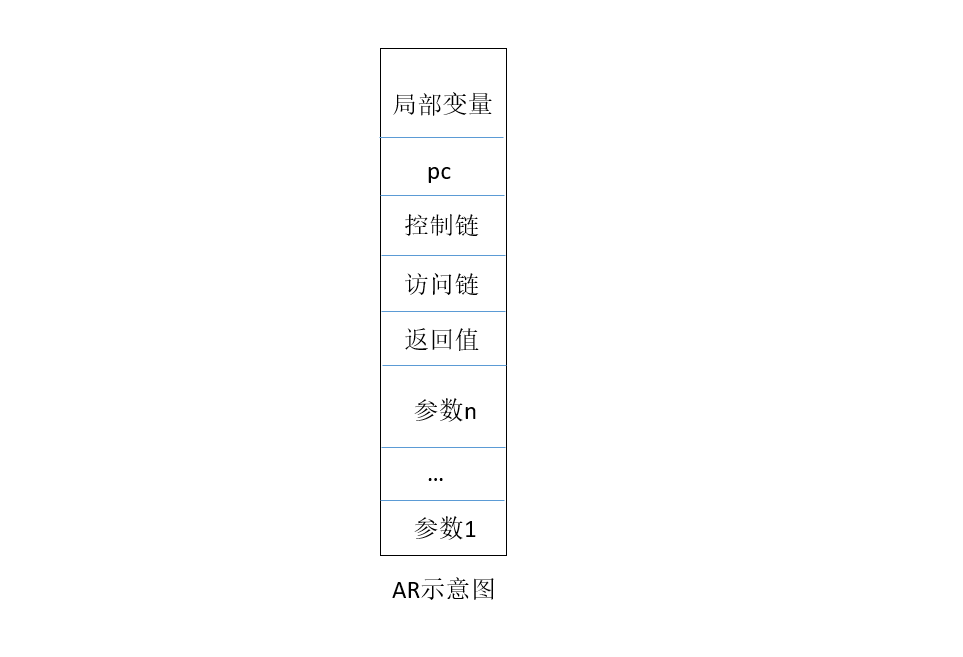
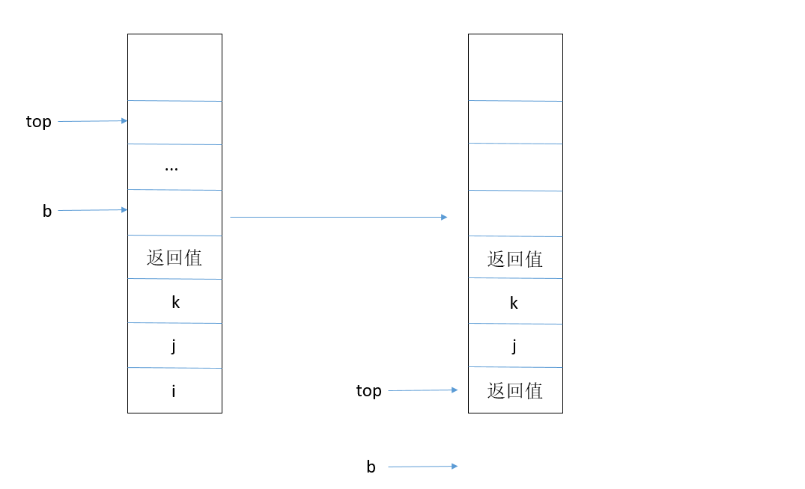
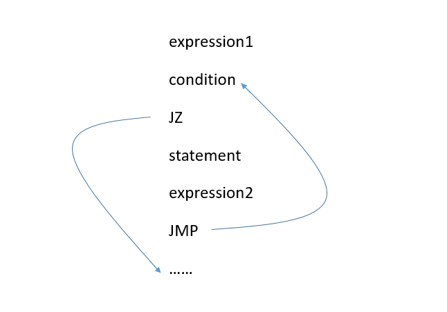

# 编译原理课程实践报告

> xxxxxx

1. 参数传递与返回。

   1. 新的添加。

      - 词法：return
      - 语法：enterPara(char  *idTemp,int kind)、procedureCall()、paraList()
      - 机器码：RET

   2. 运行时环境的组织(AR)

      

   3. 新添加函数的分析

      1. procedureCall()

         procedureCall函数在调用函数时使用，代码如下：

         ```c
         void procedureCall()
         {
         	int i;
         	mask *mk;
         	if(sym == SYM_IDENTIFIER || sym == SYM_NUMBER)
         	{
         		expr_andbit(statbegsys);
         		procedureCall();
         	}
         	else if(sym == SYM_COMMA)
         	{
         		if(presym != SYM_IDENTIFIER && presym != SYM_NUMBER)
         		{
         			printf("Error in procedureCall 2\n");
         			error(26);
         		}
         		else
         		{
         			getsym();
         			procedureCall();
         		}
         	}
         	else if(sym == SYM_RPAREN)
         	{
         		if(presym != SYM_IDENTIFIER && presym != SYM_LPAREN && presym != SYM_NUMBER && presym != SYM_RIGHTSPAREN && presym != SYM_RPAREN)
         		{
         			printf("Error in procedureCall 3\n");
         			error(26);
         		}
         		else
         		{
         			 gen(INT,0,1);
         			 getsym();
         			 return;
         		}  // for return value
         	}
         	else
         	{
         		printf("Error in procedureCall 4 and the sym is %d \n",sym);
         		error(26);
         	}
         }
         ```

         注意，我们使用procedureCall函数时，函数名和左括号已经分析过了，procedureCall的作用就是把参数依次放到栈顶，最后再给返回值留一个空间，如上面的AR示意图。

      2. paraList()

         paraList函数在block中调用，代码如下：

         ```c
         void paraList()
         {
         	if(presym == SYM_LPAREN)
         	{
         		if(sym == SYM_IDENTIFIER)
         		{
         			char idTemp[MAXIDLEN + 1]; 
         			strcpy(idTemp, id);
         			getsym();
         			paraList();
         			enterPara(idTemp,ID_VARIABLE);
         		}
         		else if(sym == SYM_RPAREN)
         		{
         			getsym();
         			return;
         		}
         		else
         		{
         			printf("error in paraList 1\n");
         			error(26);
         		}
         	}
         	else if(presym == SYM_COMMA)
         	{
         		if(sym == SYM_IDENTIFIER)
         		{
         			char idTemp[MAXIDLEN + 1]; 
         			strcpy(idTemp, id);
         			getsym();
         			paraList();
         			enterPara(idTemp,ID_VARIABLE);
         		}
         		else
         		{
         			printf("error in paraList 2\n");
         			error(26);
         		}
         	}
         	else if(presym == SYM_IDENTIFIER)
         	{
         		if(sym == SYM_RPAREN)
         		{
         			getsym();
         			return;
         		}
         		else if(sym == SYM_COMMA)
         		{
         			getsym();
         			paraList();
         		}
         		else
         		{
         			printf("error in paraList 3\n");
         			error(26);
         		}
         	}
         	else
         	{
         		printf("error in paraList 4\n");
         		error(26);
         	}
         }		
         ```

         paraList函数递归的分析函数的形参，并且调用enterPara逆序的把形参写入符号表，如分析func(i,j,k)，那么写入符号表的顺序为k,j,i。由于形参的偏移地址都是负的，所以反向写入符号表正好符合我们的AR，即第一个参数在最下方，具体如何写入的在enterPara函数中分析。

      3. enterPara(char  *idTemp,int kind)

         enterPara函数在paraList中调用，代码如下：

         ```c
         int pcount=-2; //第一个写入的参数的偏移是-2，注意第一个写入的参数是最后一个形参
         void enterPara(char *idTemp,int kind)
         {
         	mask* mk;
         	tx++;
         	strcpy(table[tx].name, idTemp);
         	table[tx].kind = kind;
         	switch(kind)
         	{
         		case(ID_VARIABLE):
         			mk = (mask*) &table[tx];
         			mk->level = level;
         			mk->address = pcount--;
         			break;
         		case(ID_RETURN):
         			mk=(mask*) &table[tx];
         			mk->level = level;
         			// printf("The pcount is %d ***************  \n",pcount);
         			mk->address = pcount+1;
         	}
         	// printf("Message of var in table is : name = %s  level = %d  address = %d  \n",table[tx].name,mk->level,(int)(mk->address));
         }
         ```

         如果把参数放在返回值的下面，那么函数返回的时候需要把参数全部退栈，那么如何知道该退栈多少呢？为此我们分析完参数列表之后，向符号表中写入了一个叫做return的特殊变量，代码如下：

         ```c
         if(sym == SYM_LPAREN)
         	{
         		getsym();
         		paraList();
         		enterPara("return",ID_RETURN);
         		// mask *mkTemp;
         		// for(int i=1;i<=tx;i++)
         		// {
         		// 	mkTemp=(mask *)&table[i];
         		// 	printf("name = %s, level = %d, address = %d\n",table[i].name,mkTemp->level,(int)(mkTemp->address));
         		// }
         	}
         ```

         这个return变量用来记录-（参数的个数+1），以方便以后参数退栈，具体如何退栈在讲解return和ret时说明。

   4. return

      return是语句，只在分析statement时出现。代码如下：

      ```c
      if(sym == SYM_RETURN)
      	{
      			mask *mk;
      			int j=position(id);
      			if(j)
      			{

      				mk=(mask *) &table[j];
      				retOffset=mk->address;
      			}
      			getsym();
      			expr_andbit(fsys);
      			gen(STO,0,-1);
      			gen(RET,0,retOffset); //2017.10.30
      			if(sym != SYM_SEMICOLON)
      			{
      				printf("expected ; in 896 but sym here is %d\n",sym);
      				err++;
      				getsym();
      			}
      			else getsym();
      	}
      ```

      分析函数体时，如果看到return，那么就要准备好返回调用函数，即恢复pc和b，修改栈顶。注意此处产生的两条指令:

      - gen(STO,0,-1)   这是一条store指令，层差为0，偏移为-1的位置就是返回值的位置，而栈顶此时就是返回值。
      - gen(RET,0,retoffset)  恢复pc和b，修改栈顶，具体实现在ret中讲。

   5. RET

      RET是一条机器码，代码如下：

      ```c
      case RET:
      			stack[b+i.a]=stack[b-1];
      			pc = stack[b + 2];
      			int bTemp=b;
      			b = stack[b + 1];
      			top=bTemp+i.a;
      			break;
      ```

      举个例子来解释RET的作用吧，还是调用func(i,j,k)，执行RET的时候，RET指令是（RET，0，-4），-4 = -（3 + 1），stack[b-1]存放的返回值，RET的执行效果如下：

      

      此时，所有的形参都被回收了，栈顶正好是返回值，可以用于后续的计算。到此，参数的传递和返回就结束了。

      ​

      ​	

2. 添加语句实现。

   1. else

      if esle 语句的格式是：

      ```c
      if(condition)
        statement1;
      else
        sattement2;
      ```

      if else语句的实现代码，如下：

      ```c
      else if (sym == SYM_IF)
      	{ // if statement
      		getsym();
      		set1 = createset(SYM_THEN, SYM_DO, SYM_NULL);
      		set = uniteset(set1, fsys);
      		if(sym != SYM_LPAREN)
      		{
      			printf("expect ( after if \n");
      			err++;
      		}
      		else
      		{
      			getsym();
      			conditions_or(set); 
      			
      			if(sym != SYM_RPAREN)
      			{
      				printf("expect ) in if expression \n");
      				err++;
      			}
      			else getsym();
      		}
      		/***9.30修改下面这一句*/
      		destroyset(set1);
      		destroyset(set);

      		cx1 = cx;
      		gen(JPC, 0, 0);  
      		statement(fsys);
      		code[cx1].a = cx+1;
      		cx1=cx;// else's beginning is a code that do not executing folllowing codes.
      		if( sym != SYM_ELSE )
      			gen(JMP,0,cx1+1);
      		else
      		{
      			getsym();
      			gen(JMP,0,0);
      			statement(fsys);
      			code[cx1].a=cx;
      		}
      }
      ```


​      　　    if else的执行情况如下图：


   3. exit

      exit的实现代码如下：

      ```c
      else if(sym == SYM_EXIT)
      	{
      		getsym();
      		if(sym != SYM_LPAREN)
      		{
      			printf("expected leftsparen after exit \n");
      			err++;
      		}
      		getsym();
      		if(sym != SYM_RPAREN)
      		{
      			printf("expected rightsparen after exit \n");
      			err++;
      		}
      		getsym();
      		if(sym != SYM_SEMICOLON)
      		{
      			printf("expected ; in 976 \n");
      			err++;
      			getsym();
      		}
      		else getsym();
      		gen(JMP,0,ENDCX);	
      	}
      ```

      ```c
      int main (int argc,char *argv[])
      {
      	...
      	code[ENDCX].f=OPR;
      	code[ENDCX].l=0;
      	code[ENDCX].a=OPR_RET;
      ...
      } // main
      ```

      ```c
      #define CXMAX      500    // size of code array
      #define ENDCX	   499
      ```

      ​

      所以最后一行代码总是返回，注意是OPR_RET，不是RET。看到exit就生成一条代码，跳转到最后一条代码。

   4. return

      上面讲述参数传递时已经详细较为详细的描述过了return的实现过程，此处就不再叙述了。

   5. for

      for语句的格式是：

      ```c
      for(expression1;condition;expression2)
      {
        statement;
      }
      ```

      for语句的实现代码如下：

      ```c
      else if (sym == SYM_FOR)
      	{
      		instruction codeTemp[100];
      		int cxTemp,tempCodeCount;
      		int CFalseAdd,ENext;
      		getsym();
      		if(sym != SYM_LPAREN)
      		{
      			printf("expected '(' after for declaration\n");
      			err++;
      		}
      		else
      		{
      			getsym();
      			if(sym != SYM_IDENTIFIER)
      			{
      				printf("expected identifier in the first field of for declaration\n");
      				err++;
      			}
      			else  // E1
      			{
      				int i=position(id);
      				mask *mk = (mask *)&table[i];
      				if(i)
      				{
      					if(table[i].kind == ID_VARIABLE)
      					{
      						getsym();
      						if(sym == SYM_BECOMES)
      						{
      							getsym();
      							expr_andbit(fsys);
      							gen(STO,level-mk->level,mk->address);
      						}
      					}
      					else // table[i].kind == ID_ARRAY
      					{
      						getsym();
      						gen(LIT,0,0);
      						readDim=0;
      						calAdd(i);
      						if(sym == SYM_BECOMES)
      						{
      							getsym();
      							expr_andbit(fsys);
      							gen(STOARR,level-mk->level,mk->address);
      						}
      					}
      				}
      				else
      				{
      					printf("Identifier undeclared!\n");
      					err++;
      				}
      			}
      			if(sym != SYM_SEMICOLON)
      			{
      				printf("expected ';' after the first field in for statement\n");
      				err++;
      			}
      			else  // Condition
      			{
      				ENext=cx;
      				getsym();
      				condition(fsys);
      				CFalseAdd=cx;
      				gen(JZ,0,0);
      			}
      			if(sym != SYM_SEMICOLON)
      			{
      				printf("expected ';' after the second field in for statement\n");
      				err++;
      			}
      			else  // E2
      			{
      				cxTemp=cx;
      				getsym();
      				if(sym != SYM_IDENTIFIER && sym != SYM_DEC && sym != SYM_INC)
      				{
      					printf("expected identifier in the first field of for declaration\n");
      					err++;
      				}
      				if(sym == SYM_INC)
      				{
      					getsym();
      					if(sym != SYM_IDENTIFIER)
      					{
      						printf("expected id here \n");
      						err++;
      						getsym();
      					}
      					else
      					{
      						int i=position(id);
      						mask *mk=(mask *)&table[i];
      						gen(LOD,level-mk->level,mk->address);
      						gen(LIT,0,1);
      						gen(OPR,0,OPR_ADD);
      						gen(STO,level-mk->level,mk->address);
      						getsym();
      					}
      				}
      				else if(sym == SYM_DEC)
      				{
      					getsym();
      					if(sym != SYM_IDENTIFIER)
      					{
      						printf("expected id here \n");
      						err++;
      						getsym();
      					}
      					else
      					{
      						int i=position(id);
      						mask *mk=(mask *)&table[i];
      						gen(LOD,level-mk->level,mk->address);
      						gen(LIT,0,1);
      						gen(OPR,0,OPR_MIN);
      						gen(STO,level-mk->level,mk->address);
      						getsym();
      					}
      				}
      				else
      				{
      					int i=position(id);
      					mask *mk = (mask *)&table[i];
      					if(i)
      					{
      						if(table[i].kind == ID_VARIABLE)
      						{
      							getsym();
      							if(sym == SYM_BECOMES)
      							{
      								getsym();
      								expr_andbit(fsys);
      								gen(STO,level-mk->level,mk->address);
      							}
      							if(sym == SYM_INC)
      							{
      						
      								gen(LOD, level-mk->level, mk->address);
      								gen(LIT, 0, 1);
      								gen(OPR, 0, OPR_ADD);
      								gen(STO, level -mk->level, mk->address);
      								getsym();
      							}
      							else if(sym == SYM_DEC)
      							{
      								gen(LOD, level-mk->level, mk->address);
      								gen(LIT, 0, 1);
      								gen(OPR, 0, OPR_MIN);
      								gen(STO, level -mk->level, mk->address);
      								getsym();
      							}
      						}
      						else // table[i].kind == ID_ARRAY
      						{
      							getsym();
      							gen(LIT,0,0);
      							readDim=0;
      							calAdd(i);
      							mk = (mask*) &table[i];
      							if(sym == SYM_BECOMES)
      							{
      								getsym();
      								expr_andbit(fsys);
      								gen(STOARR,level-mk->level,mk->address);
      							}
      						}
      					}
      					else
      					{
      						printf("Identifier undeclared!\n");
      						err++;
      					}
      				}
      				tempCodeCount=cx - cxTemp ;
      				int j;
      				for(j=0;j<tempCodeCount;j++)
      				{
      					codeTemp[j].f=code[cxTemp+j].f;
      					codeTemp[j].l=code[cxTemp+j].l;
      					codeTemp[j].a=code[cxTemp+j].a;
      				}
      				cx=cxTemp;
      			}
      			if(sym != SYM_RPAREN)
      			{
      				printf("expected SYM_RPAREN\n");
      				err++;
      			}
      			else // body
      			{
      				getsym();
      				statement(fsys);
      				int i;
      				for(i=0;i<tempCodeCount;i++)
      				{
      					code[cx].f=codeTemp[i].f;
      					code[cx].l=codeTemp[i].l;
      					code[cx++].a=codeTemp[i].a;
      				}
      				gen(JMP,0,ENext);
      				code[CFalseAdd].a=cx;
      			}
      		}
      	}
      ```

      for循环的执行过程如下图：

      

      ​

   注意在for循环的代码中，expression2应该在statement的前面，但是为了减少执行时的跳转指令的数目，引入了“代码移动”技术。“代码移动”的实现如下：

   ```c
   tempCodeCount=cx - cxTemp ;
   int j;
   for(j=0;j<tempCodeCount;j++)
   {
     codeTemp[j].f=code[cxTemp+j].f;
     codeTemp[j].l=code[cxTemp+j].l;
     codeTemp[j].a=code[cxTemp+j].a;
   }
   cx=cxTemp;
   ```

   ```c
   int i;
   for(i=0;i<tempCodeCount;i++)
   {
     code[cx].f=codeTemp[i].f;
     code[cx].l=codeTemp[i].l;
     code[cx++].a=codeTemp[i].a;
   }
   ```

   cxTemp是在分析expression2前记下的cx的值，分析完expresion2之后，cx-cxTemp即得到有多少条代码需要移动，把这些代码存在一个临时数组中，再把cx赋值为cxTemp，在分析完statement后，紧接着把临时数组中的代码复制到后面，就实现了“代码移动”。

   在for循环中使用++、--，代码如下：

   ```c
   if(sym != SYM_IDENTIFIER && sym != SYM_DEC && sym != SYM_INC)
   {
     printf("expected identifier in the first field of for declaration\n");
     err++;
   }
   if(sym == SYM_INC)
   {
     getsym();
     if(sym != SYM_IDENTIFIER)
     {
       printf("expected id here \n");
       err++;
       getsym();
     }
     else
     {
       int i=position(id);
       mask *mk=(mask *)&table[i];
       gen(LOD,level-mk->level,mk->address);
       gen(LIT,0,1);
       gen(OPR,0,OPR_ADD);
       gen(STO,level-mk->level,mk->address);
       getsym();
     }
   }
   else if(sym == SYM_DEC)
   {
     getsym();
     if(sym != SYM_IDENTIFIER)
     {
       printf("expected id here \n");
       err++;
       getsym();
     }
     else
     {
       int i=position(id);
       mask *mk=(mask *)&table[i];
       gen(LOD,level-mk->level,mk->address);
       gen(LIT,0,1);
       gen(OPR,0,OPR_MIN);
       gen(STO,level-mk->level,mk->address);
       getsym();
     }
   }

   ```

   这是在for循环中使用++id，--id，下面是id++，id--：

   ```c
   if(table[i].kind == ID_VARIABLE)
   {
     getsym();
     if(sym == SYM_BECOMES)
     {
       getsym();
       expr_andbit(fsys);
       gen(STO,level-mk->level,mk->address);
     }
     if(sym == SYM_INC)
     {

       gen(LOD, level-mk->level, mk->address);
       gen(LIT, 0, 1);
       gen(OPR, 0, OPR_ADD);
       gen(STO, level -mk->level, mk->address);
       getsym();
     }
     else if(sym == SYM_DEC)
     {
       gen(LOD, level-mk->level, mk->address);
       gen(LIT, 0, 1);
       gen(OPR, 0, OPR_MIN);
       gen(STO, level -mk->level, mk->address);
       getsym();
     }
   }
   ```

   具体实现就是把id取出来放在栈顶，再加上1，或者减去1，再放回去。